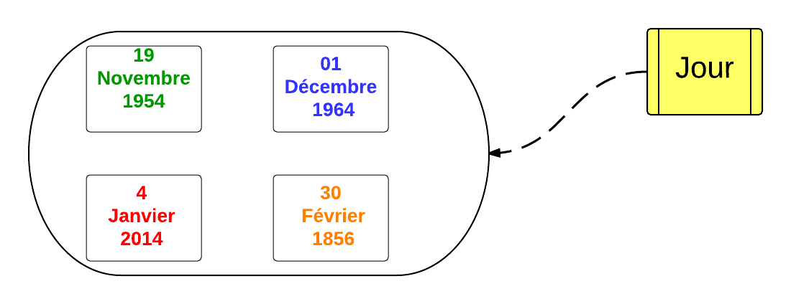
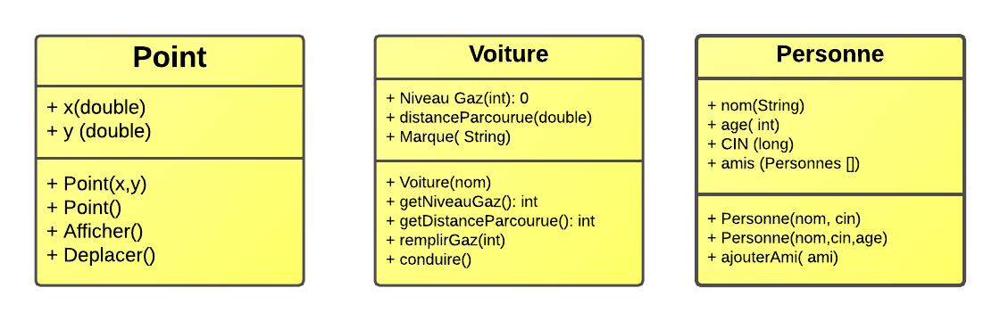
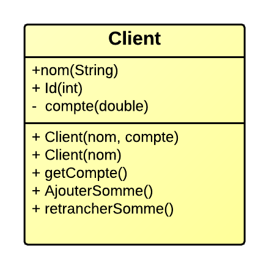
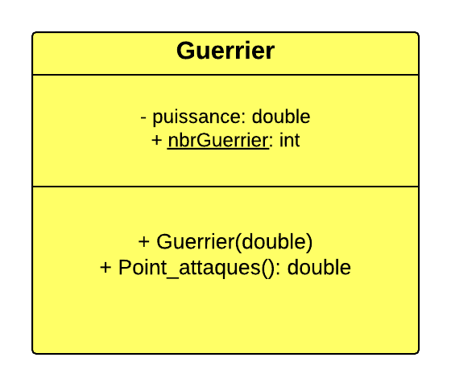

.. _classes::

***********************************************
Classes, Objets et méthodes
***********************************************

.. topic:: Objectifs

    * Définir des **classes** et créer des objets.

    * Ajouter un comportement et une intelligence à une classe à travers les **méthodes**

    * Appeler des méthodes d'un objet pour compléter une tache.

    * Utilisation de plusieurs **constructeurs**.

    * **Encapsuler** les données importantes.

Classes
=========

Une classe est un **prototype** pour plusieurs *objets* qui partagent les mêmes *attributs* et *comportement* (fonctionnalités).

    Jour

**Exemples**

Voici quelque exemples de classes.

* Point : pour définir un point dans le plan :math:`P(x,y)`.
* Personne: définition d'une personne.
* Voiture.

En uml on peut représenter ces classes, avec un diagramme de classes:

    Diagram des classes

Point
=====

En se basant sur le diagramme **UML**, voici la définition de la classe Point

.. literalinclude:: ../codes/chap06/Point.java
    :language: java
    :linenos:

Un programme qui va utiliser cette classe.

.. literalinclude:: ../codes/chap06/PointDriver.java
    :language: java
    :linenos:

**Question**

1. Ajouter une lettre comme nom du point.

2. Ajouter une méthode pour changer le nom du point.

3. Avec cette implémentation, est ce qu'un point connaît son **symétrique**.

.. math::

    si A(x,y) \Longrightarrow S(-x,-y)

-------------------------------------------

Client Bancaire
=================

Construire en java une classe qui représente un client dans une banque.

    Client diagramme

.. note::

    * L'identifiant **id** du client doit vérifier ::math:`id \in [1,15]`. et *ne peut pas* être modifié une foie un client est enregistré.

    * On doit pas accéder et changer au compte directement mais a travers une **interface** (API).

    * Dans le diagramme *UML*, lister les fonctions qui indique cette **interface**.

.. literalinclude:: ../codes/chap06/Client.java
    :language: java
    :linenos:
    :emphasize-lines: 14,15

Programme utilisant cette classe.

.. literalinclude:: ../codes/chap06/ClientDriver.java
    :language: java
    :linenos:
    :emphasize-lines: 13

.. warning::

    La ligne 13 du programme essaie de modifier un attribut **privé**, ce qui va générer une erreur.

Attributs statiques
===================

Chaque Objet d'une classe possède sa propre **copie** des attributs de la classes. mais dans certains cas, juste une **seule copie** de la classe pourra être *partagée* entre tous objets.

Un attribut **statique**, ou *attribut de la classe* est utilisé dans ces cas. pour stocker une information générale de la classe et sera partagé par tous les **instances** de cette classe.

La déclaration de type de membre est réalisé par le mot clé **static**.

Exemples
--------

Quelque exemples des membres statiques.

* Nombre de Clients dans une banque.
* Type de stockage d'une structure de donnée.
* Type d'orientation des formes géométriques.

.. code-block:: java

    class Client
    {
        private static nb_Clients=0.0;
        private String nom
        private double compte;
    }

Exemple illustratif
-------------------

Dans cet exemple on se propose de créer un modèle simple d'une classe **Guerrier**.

    Diagramme de la classe Guerrier. (les membres statiques sont en italiques)

.. note::

    Pour calculer les points d'attaques d'un guerrier en utilise la formule suivante::

        Ps_attaques=(puissance*1000)+300*nbrGuerrier.

.. centered:: Exercice

1. Ajouter une méthode pour afficher le nombre de guerrier?
2. Que remarquez vous?

Classe math
-----------

La classe **math** utilise la notion de

* membre statique
* fonctions statiques

Pour fournir une implémentation pour la plupart des  **constantes** et **fonctions** mathématiques usuelles.

.. literalinclude:: ../codes/chap06/MathExemples.java
    :language: java
    :linenos:

Union_Find
==========
