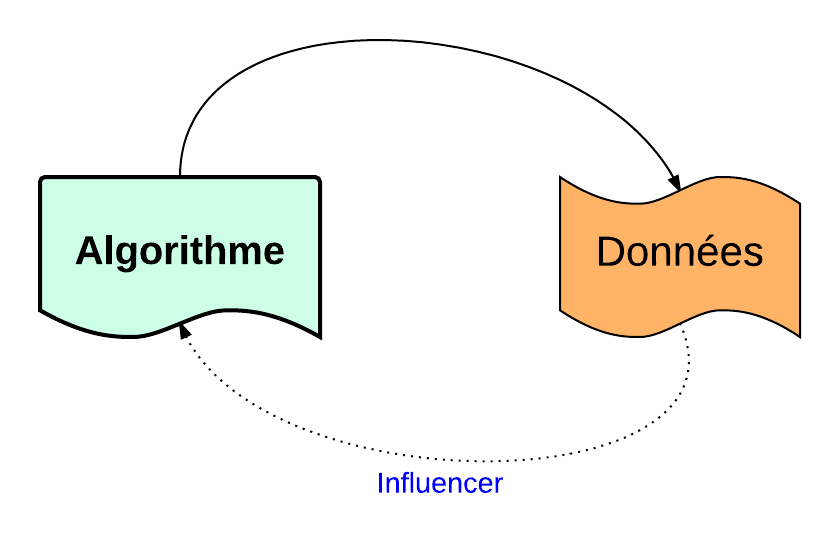

.. _structures1:

************************
Structures de Contrôle 1
************************

* Pour qu'un programme, soit intéressant, il faut que les données puissent **influencer** le traitement.

	Relation algorithme et données

* Les donnees d'un algorithme doivent posséder la possibilité d'influencer les **instructions** d'un algorithme.

Exécution séquentielle
-----------------------

* Jusqu'à maintenant, nos programmes se limitaient au cas séquentiel. *ie* (commandes ligne après ligne)

.. note::

    Les structure de **contrôle** permettent de changer ce comportement.

Il existe trois structures de contrôle:

1. les **Branchement conditionnels**
2. Les itérations, (finie)
3. Les boucles **conditionnées**

-------

Branchement conditionnels
==========================

* Ces instructions permettent de **choisir** ou de **sauter** quelque *instructions*, si certains **conditions** sont remplies. en utilisant le mot clé **if**.

Exemple 1
----------

.. literalinclude:: ../codes/chap02/TesteurNote.java
    :language: java
    :linenos:
    :emphasize-lines: 22,26

ce code va **lire** la valeur de la note entrée par le clavier, et **selon** cette valeur, le programme va afficher un message *convenable*.

.. note::

    On peut ajouter **autant** d'instructions dans le bloc **if** et **else**.

.. literalinclude:: ../codes/chap02/TesteurNote2.java
    :language: java
    :linenos:

la syntaxe **générale** d'un branchement conditionnel est::

    if(condition)
    {
        instructions
    }
    else if
    {
        instructions
    }
    else
    {
        instructions
    }

Choix imbriquées
-----------------

* Les instructions dans dans le blocs **if** et **else** peuvent contenir n'importe quel code java, et donc il peuvent contenir aussi une instruction **if** ce qui en résulte à des **choix imbriquées**.

Exemple
--------

.. literalinclude:: ../codes/chap02/TesteurEgalite.java
    :language: java
    :linenos:

Opérateurs logiques
===================

* Une condition **simple** compare deux expressions, en utilisant les opérateurs de **comparaisons**

Opérateurs de comparaison
--------------------------

.. table:: Opérateurs de comparaison

    ===========  ==========================
      Opérateur            signification
    ===========  ==========================
        <            inférieur à
        >            supérieur à
        <=          inférieur ou égal
        >=           supérieur ou égal
        ==           égale à
        !=           différent de
    ===========  ==========================

-------

Opérateur logiques
--------------------

On peut relier des conditions **simples** par des opérateur **logiques**.

**L'opérateur logique ET(&&)**

qui est **Vrai*** si et seulement si tous les conditions simples sont **Vraies**.

**Exemple**::

    (a<b) && (b<c)

sera **Vrai** uniquement is **a<b** est *vrai*, et **b<c** est *vrai*.

.. code-block:: java

    if((note>=0) && (note<=20))
    {
        System.out.println("Note valide");
    }
    else
    {
        System.out.println("Note non reconnue");
    }

------

**L'opérateur logique OU**

Est **Vrai*** si  *seulement l'une** des conditions simples est **Vraie**.

**Exemple**::

    (m>0) && (m>0)

sera **Vrai** l'une des valeurs **m** ou **n** est positive.

.. code-block:: java

    if((n>0) && (m>0))
    {
        System.out.println("L'une des valeurs est positive");
    }
    else
    {
        System.out.println("les deux valeurs sont négatifs");
    }

.. table:: Table logique

    =========  ==========    ============== ==================
     P             Q           P et Q       P ou Q
    =========  ==========    ============== ==================
      Vrai       Vrai           Vrai         Vrai
      Vrai       Faux           Faux         Vrai
      Faux       Vrai           Faux         Vrai
      Faux       Faux           Faux         Faux
    =========  ==========    ============== ==================

Erreurs classiques
====================

Ici on regroupe quelque erreurs de débutants.

test d'égalité
--------------

.. code-block:: java

    if(a=b)  // !!! ne sera pas accepté par le compilateur

if et ;
-------

.. code-block:: java

    if(a==2); !!
        System.out.println("a="+2);

Dans ce cas la message sera **toujours** affiché, quelque soit la valeur de **a**.

else sans accolade
------------------

.. code-block:: java

    if( a<b)
        System.out.println("a<b");
        max=b;
    else  //!!

        System.out.println("a>b");

Donnera un message d'erreur.

Exercices d'applications
=========================

#. Ecrire un programme **MoyenneModule** qui demande une **note** à l'utilisateur,et vérifie s'ils sont valides. ie( :math:`\in [0,20]`).
#. modifier **MoyenneModule** pour vérifier **deux** notes.
#. Calculer la moyenne des deux notes, puis informer l'utilisateur s'il a validé le module ou non.::

    moyenne >=12     ===> validé
    sinon            ===> non validé

#. Modifier le programme **TesteurEgalite.java** en ajoutant un test *complexe* utilisant **Et**.

#. Écrivez un programme Java qui lit un nombre et indique s'il est positif, négatif ou s'il vaut zéro et s'il est pair ou impair.::

    Entrez un nombre entier: 5
    Le nombre est positif et impair

    Entrez un nombre entier: -4
    Le nombre est négatif et pair

    Entrez un nombre entier: 0
    Le nombre est zéro (et il est pair)

================

Les boucles finies
===================

* Souvent dans un programme, on a besoin de **répéter** certains instructions pour aboutir à un résultat.

**Exemple:**

Afficher les carrés des 5 premiers entiers de :math:`\mathbb{N}`::

    le carré de 0   est    0
    le carré de 1   est    1
    le carré de 2   est    4
    le carré de 3   est    9
    le carré de 4   est    16

On peut obtenir ce résultat en utilisant une boucle **for** comme suit.

.. code-block:: java

    for(int i=0;i<5;i++)
        System.out.println("le carré de "+i+" est "+ i*i);

La boucle **for** contient trois parties qui sont

* initialisation

    exécutée *une seule* fois au début de la boucle.

* Test d'arrêt:

    qui sera testé **avant** l'exécution de chaque tour de la boucle.

* Incrémentation:

    Exécutée à la fin de chaque tour, elle permet de **changer** la valeur de *compteur*.

Donc la syntaxe générale d'une boucle for en **Java** est::

    for(Initialisation; test d'arrêt; Incrémentation)
    {
                 Bloc d'instructions;
    }

Exemple 2:
----------

Voici un deuxième exemple de la **table de multiplication** de :math:`7`.

.. literalinclude:: ../codes/chap02/TableMult7.java
    :language: java
    :linenos:

Affichera ::

    5 *1 = 5
    5 *2 = 10
    5 *3 = 15
    5 *4 = 20
    5 *5 = 25
    5 *6 = 30
    5 *7 = 35

.. note::

    Le **bloc d'instruction** de for peut contenir n'importe quel *code* java.

Par exemple il peut contenir une instruction **if**

**Question**

Quel sera le résultat du programme suivant:

.. code-block:: java

    for(int i=0;i<5;i++)
    {
        System.out.print(i);

        if( i%2==0)
        {
            System.out.print("p");
        }

        System.out.print(" ");
    }

D'autre exemples
-----------------

**Saut différent**

.. code-block:: java

    for(int p=0;p<10;p=p+2)
        System.out.print(p+" ");

Affichera::

    0  2  4  6  8

.. note::

    Dans cet exemple **p=p+2** pourrait être ecrit par **p+=2**

**Décrémentation**

.. code-block:: java

    for(int k=10;k>5;k--)
        System.out.println(k+" ");

Affichera::

    10 9 8 7 6

**Exemple classique**

Dans ce simple programme on se propose de calculer la **moyenne** de :math:`10` valeurs entrées par le clavier.

.. literalinclude:: ../codes/chap02/Moyenne10.java
    :language: java
    :linenos:

**boucle For imbriquées**

On peut introduit des boucle **for** à l'intérieur d'une boucle **for**.

Exemple
--------

Qeul sera le résultat du programme suivant:

.. code-block:: java

    for(int i=0;i<4;i++)
        {
            for(int j=0;j<4;j++)
            {
                if(i==j)
                {
                    System.out.print("*");
                }
                else
                {
                    System.out.print("j");
                }
            }

            System.out.println(" ");
        }

Exercices
=========

#. (+) Ecrire un programme pour afficher les nombres **impairs** compris entre :math:`0` et :math:`30`.

#. (++) Ecrire un programme pour calcule le produit entre deux entiers a et b positifs. en utilisant la formule suivante:

.. math::

    ab=\underbrace{a+a+\ldots+a}_{b \; fois}

3. (+++)Ecrire un programme pour afficher la **table de multiplication**.

===========

Boucles conditionnelles
========================

Selon le problème à résoudre. il arrive qu'on **ne connaisse** pas combien de fois la *boucle** devra être exécutée.

Dans ce cas, on utilise une **boucle conditionnelle**, ou boucle **while**, **do .. while**.

Exemple:
--------

Pour illustrer l'utilisation d'une boucle conditionnelle, on présentera un programme qui  as **besoin** que qu'une valeur *nbNotes* soit **positive**.

.. literalinclude:: ../codes/chap03/Moyenne.java
    :language: java
    :linenos:

Ici une valeur **négative** de l'utilisateur n'aura aucun sens. donc on se propose de **forcer** une condition sur cette valeur.

.. math::

    nbNotes>0

Donc on va introduire une **boucle** qui va se répéter **tant que** cette valeur est **négative**.

.. code-block:: java

    do
    {
        System.out.println("Entrer le nombre de notes:");
        nbNotes=clavier.nextInt();
    }while(nbNotes<=0)

#. Modifier le programme **Moyenne1.java** pour refuser les valeurs négatifs de nbNotes

Syntaxe générale:
-----------------

.. code-block:: java

    do
    {
        instructions;

    }while(condition);

* La condition peut utiliser des *opérateurs logiques*.
* la parenthèse autour de la condition sont **obligatoires**.

.. note::

    Les instructions à l'intérieur de **do while** seront toujours exécutées **au moins un fois**

Boucle while
------------

Dans certains conditions, on veut tester les conditions **a priori** avant d'enter dans le corps de la boucle. dans ce cas on utilise une deuxième forme de la boucle **while**.

.. code-block:: java

    while(condition)
    {
        instructions
    }

* Le principe est **similaire**, avec la seule différence que le test sera testé **avant** d'enter dans la boucle.
* Donc les instructions de while peuvent **ne jamais** être exécutées.

exemples
--------

.. code-block:: java

    int i=100;
    do
    {
        System.out.println("Bonjour");
    } while(i<10);

Le programme affichera::

    Bonjour

par contre le programme suivant:

.. code-block:: java

    int i=100;

    while(i<10)
    {
        System.out.println("Bonjour");
    }

**N'affichera** rien car les instructions de la boucle ne sont jamais exécutées.

----------

Exercice d'application
=======================

Dans cet exercice on se propose, de développer le code d'un jeu **simple** de devinette d'un nombre entier. où la machine va choisir un nombre *entier* dans :math:`[0,10]`, et à l'utilisateur de deviner cette valeur.

1. Pour générer une valeur **aléatoire** entière on utilisera la *classe* **Random** du package *java.util*

.. code-block:: java

    import java.util.Random;

    //instancier un object Random
    Random R=new Random();

    //générer un nombre < n
    int a=R.nextInt(n);

2. Ecrire un programme **JeuDevinette.java** pour générer et *afficher* 15 valeurs aléatoires inférieurs à :math:`10`.

3. Le but du jeu est de générer une valeur aléatoire <10, et demander à l'utilisateur de **deviner** ce nombre.

    * Au cas d'égalité, le  jeu s'arrête.
    * Au cas <nombre, on informe l'utilisateur qu'il doit donner une valeur **inférieure**.
    * Au cas >nombre, on informe l'utilisetuer qu'il doit donner une valeur **supérieure**.

4. Modifier votre programme pour limiter le nombre d'essai à **Trois** essais maximum.
